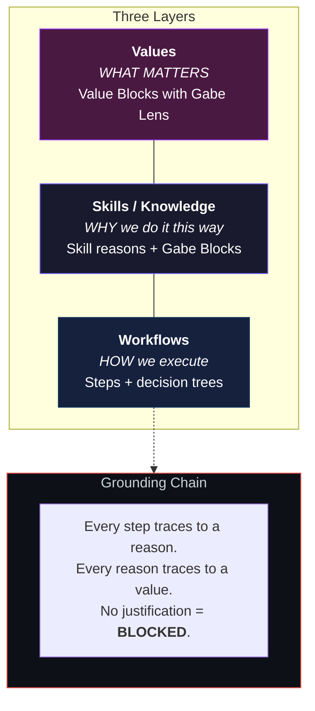
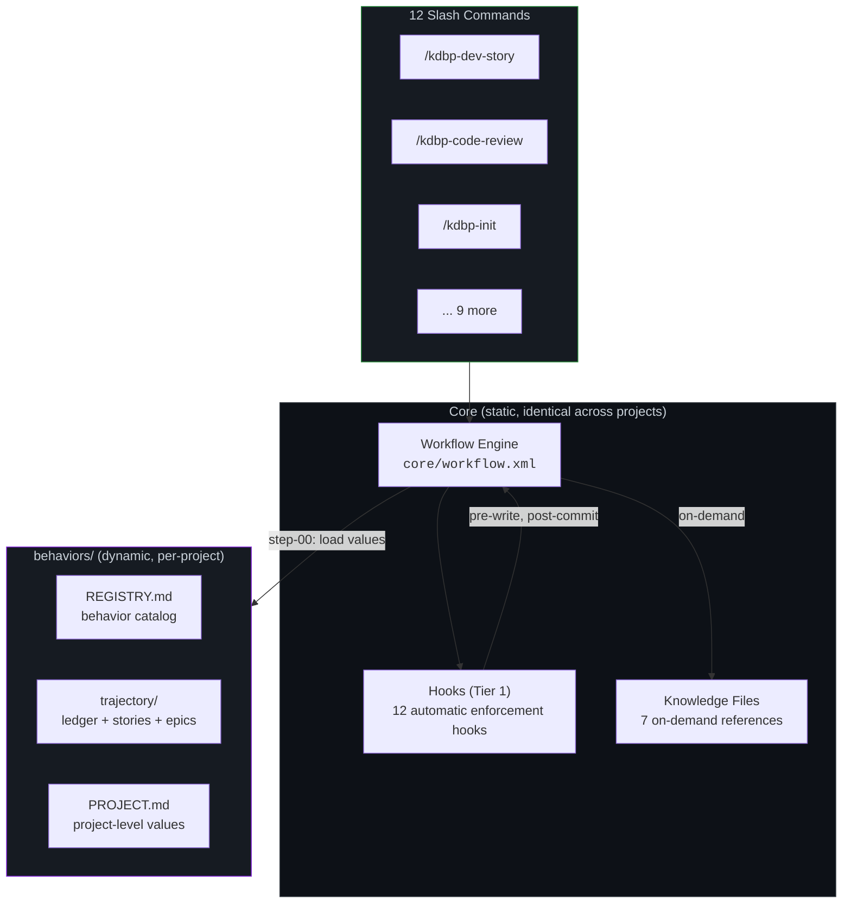

<p align="center">
  <h1 align="center">KDBP</h1>
  <p align="center"><strong>Khujta Deep Behavior Protocol</strong></p>
  <p align="center">
    <em>Your AI agent does exactly what you asked.<br>But is it doing what you meant?</em>
  </p>
</p>

<p align="center">
  <a href="#quick-start"></a>
  
  
  
  
  <a href="LICENSE"></a>
</p>

---

## The Problem

Most agent frameworks solve **memory**, persisting context across sessions.
That's table stakes. The harder problem is **alignment drift**:

Your agent builds exactly what the story says, passes all tests, ships clean code.
Three sprints later you realize it's been solving the wrong problem the entire time.

KDBP calls this a **Type F error** — the hardest to detect, because nothing looks broken until you've wasted three sprints.

> *"The bones don't change. The nervous system adapts."*

## What makes KDBP different

KDBP adds a **value layer** on top of session records, letting you ask
*why* a workflow step exists, and catch when steps are technically correct but
directionally wrong.



The grounding chain is what holds it together: `step -> skill reason -> value`.
If a workflow step can't justify itself through a skill reason that traces to a value,
it's **blocked from shipping**. Not deferred — blocked.

### Root cause classification

When something goes wrong, KDBP classifies the *why*, not the *what*:

| Type | Root Cause | Fix | Example |
|------|-----------|-----|---------|
| **A** | Doing — step is wrong | Fix the step | Wrong git command |
| **B** | Knowing — reason is wrong | Fix reason + cascade | Misunderstood API behavior |
| **C** | Linking — wrong mapping | Fix the linkage | Step exists but serves wrong value |
| **D** | Gap — missing knowledge | Research + add | Didn't know about rate limits |
| **E** | Drift — world changed | Update both | API deprecated, need new approach |
| **F** | Alignment — wrong direction | **Triple loop** | Built the feature perfectly, but it shouldn't exist |

**Type F** is what other frameworks miss. Catching it means loading full Value Blocks
and running a project-level alignment check. KDBP has a dedicated command for it (`/khujta-dbp EA`).

### Gabe Lens — Cognitive translation

Complex values and skill reasons are encoded using **Gabe Lens**: physical-system analogies,
constraint boxes, and one-line handles that survive context compaction.

```
VALUE BLOCK: Input Sanitization

THE INTENT — Users get data corruption or security breaches
THE ANALOGY — Water treatment plant: every pipe from outside goes through
             the filter, no matter how clean it looks
CONSTRAINT BOX
  IS:     Every user string through sanitize() before storage
  IS NOT: Validation (format checking is separate)
  DECIDES: Whether to accept, truncate, or reject the input
ONE-LINE HANDLE — "All external pipes through the filter"
ANALOGY LIMITS — Breaks for binary data; revisit if we add file uploads
EVALUATION ALTITUDE — Story
```

The handle *"All external pipes through the filter"* survives compaction.
The full block loads only at evaluation checkpoints.

### Evaluation authority

Not everything is the agent's call:

| Altitude | Who Decides | When |
|----------|------------|------|
| **Session** | Agent alone | During workflow execution |
| **Story** | Agent drafts, **human approves** | `/khujta-dbp SC` — story completion |
| **Epic** | Agent prepares, **human decides** | `/khujta-dbp EC` — epic completion |
| **Project** | Human-driven | On-demand alignment check |

The agent is explicit: *"This is a draft. Your judgment is authoritative."*

### Adversarial patterns (12 structural blind spots)

Cataloged from 8 adversarial reviews (85+ findings), organized by how reliably they're caught:

| Tier | Enforcement | Catch Rate | Examples |
|------|------------|------------|---------|
| **Tier 1 — Hooks** | Automatic, every session | ~99% | Missing infrastructure, orphaned references |
| **Tier 2 — Workflow gates** | LLM reasoning at story gates | 60-80% | Wrong ordering, incomplete specs, no scaling strategy |
| **Tier 3 — Design principles** | Human vigilance only | 30-50% | Domain mismatch, enforcement gaps |

*"If it's not a hook, it's a suggestion. Suggestions get ignored."*
Tier 3 patterns are labeled as unhookable because they are.

## Quick start

```bash
# 1. Copy KDBP into your project
cp -r _kdbp/ your-project/_kdbp/

# 2. Install hooks
cp _kdbp/hooks/shared/* your-project/.claude/hooks/
cp _kdbp/hooks/*.{py,sh} your-project/.claude/hooks/

# 3. Copy slash commands
cp _kdbp/commands/*.md your-project/.claude/commands/

# 4. Initialize (run inside Claude Code)
/kdbp-init
```

That's it. Your workflows now have a behavioral layer.

## What it looks like

**After a dev session**, KDBP auto-generates a ledger entry:

```markdown
| Date       | Story    | PM-Ref | Behavior       | Outcome                                  | Signals             |
|------------|----------|--------|----------------|------------------------------------------|---------------------|
| 2026-03-05 | AUTH-003 | SP-12  | input-sanitize | All service fns sanitized, 3 new tests   | carry: API rate-limit |
```

**During `/kdbp-dev-story`**, project knowledge loads automatically:

```
Step 01 — Project Knowledge Loading

  Knowledge loaded for session:
  - Code review patterns: 16 heuristics (git staging, input sanitization, batch ops...)
  - Architecture: DB patterns, state management, component patterns
  - Testing guidelines: loaded

  ECC agents will receive cached context.
```

**During `/kdbp-code-review`**, the reviewer checks YOUR patterns, not generic ones.
If your project documents "all service functions must sanitize user strings",
the reviewer verifies it. If your architecture says "no direct DB calls from components",
the reviewer catches violations.

**When something feels off**, you run `/khujta-dbp EA`:

```
Alignment Check — Story Altitude

  Loading cold tier: full Value Blocks...
  Checking grounding chain for AUTH-003:
    Step 04 (planning)     → P4 self-inconsistency gate  → Value: structural-integrity  ✓
    Step 05a (TDD setup)   → test-first reason           → Value: input-sanitization     ✓
    Step 08 (review)       → adversarial P7 check        → Value: validation-before-action ✓

  FINDING: Step 06 has no skill reason in linkage map.
  VERDICT: BLOCK — add justification or remove the step.

  This is a draft. Your judgment is authoritative.
```

## What you get

### 11 Workflows (95 step files)

> Most projects use 2-3 workflows daily (`/kdbp-dev-story` + `/kdbp-code-review`).
> The rest are there when you need them.

**Development** — your existing workflow + behavioral layer:

| Command | Steps | What It Adds |
|---------|-------|-------------|
| `/kdbp-dev-story` | 11 | TDD-first dev with automatic ledger recording |
| `/kdbp-code-review` | 9 | Multi-agent review with 16 learned heuristics |
| `/kdbp-create-story` | 9 | Story creation with classification + parallel review |
| `/kdbp-create-epics` | 13 | Epic generation with hardening analysis + cross-epic checks |

**Planning** — structured elicitation with adaptive menus:

| Command | Steps | What It Adds |
|---------|-------|-------------|
| `/kdbp-prd` | 10 | Product requirements with domain-aware complexity |
| `/kdbp-architect` | 8 | Architecture design with pattern library |
| `/kdbp-ux-design` | 7 | UX spec with design system generation |
| `/kdbp-brainstorm` | 6 | Structured ideation (target: 100 ideas per session) |

**Behavioral** — the meta-layer:

| Command | Steps | What It Adds |
|---------|-------|-------------|
| `/kdbp-init` | 9 | One-time bootstrap: creates behaviors/, registry, trajectory |
| `/kdbp-evolve-behavior` | 7 | Evolution engine with adversarial review ("The Roast") |
| `/kdbp-alignment-check` | 6 | Reflection checkpoint at session/story/epic/project altitude |

### Behavioral agent

```
/khujta-dbp          → 20-protocol menu (create, evolve, evaluate, absorb)
/khujta-dbp reflect  → 5-item reflection menu (quick alignment check)
```

<details>
<summary><strong>7 Knowledge Files (loaded on-demand, ~3K tokens total)</strong></summary>

| File | Tokens | Purpose |
|------|--------|---------|
| `quick-reference.md` | ~240 | Agent default context (always hot) |
| `format-reference.md` | ~400 | Block templates (Value, Gabe, Intent) |
| `code-review-patterns.md` | ~800 | 16 production-tested review heuristics |
| `adversarial-patterns.md` | ~600 | 12 structural blind spots |
| `hardening-patterns.md` | ~500 | 6 proactive debt reduction patterns |
| `dbp-workflow-integration.md` | ~300 | Integration architecture |
| `infrastructure-manifest.md` | ~200 | Required files per directory type |

</details>

## Architecture



## Requirements

- [Claude Code](https://docs.anthropic.com/en/docs/claude-code) (any model — works with Opus, Sonnet, Haiku)
- Bash shell (hooks use `.sh` and `.py` scripts)
- No external dependencies — KDBP is pure markdown, YAML, and XML

<details>
<summary><strong>Design decisions</strong></summary>

| Decision | Rationale |
|----------|-----------|
| **Record always, evaluate on demand** | Ledger entries are cheap (~500 tokens). Alignment evaluation is expensive and human-triggered. |
| **Knowledge files, not monolith protocol** | Agent loads `quick-reference.md` (~240 tokens), not the full protocol (~3,800 tokens). |
| **Hooks are Tier 1** | Automatic enforcement. Everything else is Tier 2. *"If it's not a hook, it's a suggestion."* |
| **Graceful degradation** | No `behaviors/` directory? All KDBP checks become no-ops. Zero overhead. |
| **Static core + dynamic injection** | Workflows are structurally identical across projects. What changes is the values and knowledge loaded at injection points. |

</details>

<details>
<summary><strong>Directory structure</strong></summary>

```
_kdbp/
├── agents/           # khujta-dbp behavioral agent (20 protocols)
├── behaviors/        # Per-project: REGISTRY, trajectory, stories, epics
├── commands/         # 12 slash commands
├── core/             # Workflow engine + config
│   └── advanced-elicitation/  # Adaptive questioning methods
├── hooks/
│   └── shared/       # 10 common hooks (Tier 1, shared with ECC)
├── knowledge/        # 7 reference docs (on-demand loading)
└── workflows/        # 11 workflows, 95 step files
    ├── kdbp-dev-story/
    ├── kdbp-code-review/
    ├── kdbp-create-story/
    ├── kdbp-create-epics/
    ├── kdbp-prd/
    ├── kdbp-architect/
    ├── kdbp-ux-design/
    ├── kdbp-brainstorm/
    ├── kdbp-init/
    ├── kdbp-evolve-behavior/
    └── kdbp-alignment-check/
```

</details>

## Acknowledgments

KDBP's workflow engine and step-file architecture build on patterns from
[everything-claude-code](https://github.com/anthropics/anthropic-cookbook/tree/main/misc/everything-claude-code) (ECC).
The agent definitions were originally generated using the BMB suite from
[BMAD](https://github.com/bmadcode/BMAD-METHOD).

## Contributing

Found a bug? Have a workflow idea? [Open an issue](https://github.com/khujta/kdbp/issues).

Want to add a workflow or knowledge file? PRs welcome — just follow the existing step file format.

---

<p align="center">
  <sub>Built for developers who want their AI agent to know <em>why</em>.</sub>
</p>
