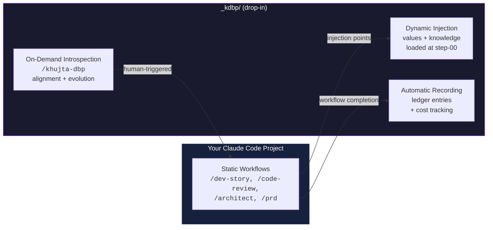
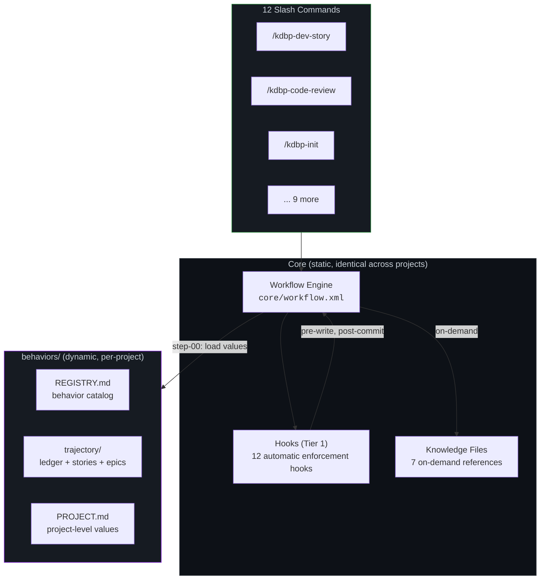

<p align="center">
  <h1 align="center">KDBP</h1>
  <p align="center"><strong>Khujta Deep Behavior Protocol</strong></p>
  <p align="center">
    <em>Your Claude Code agent forgets what it learned last session.<br>KDBP makes it remember — and evolve.</em>
  </p>
</p>

<p align="center">
  <a href="#quick-start"></a>
  
  
  
  
  <a href="LICENSE"></a>
</p>

---

## The Problem

Claude Code workflows are stateless. Every session starts from zero.
Your agent doesn't know what worked last time, what failed, or why you made
a design decision three sprints ago.

**KDBP fixes this.** It adds a behavioral layer on top of your existing workflows
that records decisions, injects project-specific knowledge at the right moments,
and lets you run alignment checks when *you* decide — not on every prompt.

> *"The bones don't change. The nervous system adapts."*

## How It Works



### Three Capabilities

| Capability | What It Does | Overhead |
|-----------|-------------|----------|
| **Recording** | Auto-generates ledger entries and cost tracking at workflow completion | ~500 tokens/session |
| **Injection** | Loads project-specific values and knowledge at designated workflow steps | Zero (on-demand file reads) |
| **Introspection** | Alignment checks, story/epic checkpoints, behavior evolution engine | Human-triggered only |

## Quick Start

```bash
# 1. Copy KDBP into your project
cp -r _kdbp/ your-project/_kdbp/

# 2. Install hooks
cp _kdbp/hooks/shared/* your-project/.claude/hooks/
cp _kdbp/hooks/*.{py,sh} your-project/.claude/hooks/

# 3. Copy slash commands
cp _kdbp/commands/*.md your-project/.claude/commands/

# 4. Initialize (run inside Claude Code)
/kdbp-init
```

That's it. Your workflows now have behavioral memory.

## What It Looks Like

**After a dev session**, KDBP auto-generates a ledger entry:

```markdown
| Date       | Story       | PM-Ref | Behavior     | Outcome                          | Signals            |
|------------|-------------|--------|--------------|----------------------------------|---------------------|
| 2026-03-05 | AUTH-003    | SP-12  | input-sanitize | All service fns sanitized, 3 new tests | carry: API rate-limit |
```

**During `/kdbp-dev-story`**, your project knowledge is loaded automatically:

```
Step 01 — Project Knowledge Loading

  Knowledge loaded for session:
  - Code review patterns: 16 heuristics (git staging, input sanitization, batch ops...)
  - Architecture: DB patterns, state management, component patterns
  - Testing guidelines: loaded

  ECC agents will receive cached context.
```

**During `/kdbp-code-review`**, the reviewer checks YOUR patterns — not generic ones.
If your project documents "all service functions must sanitize user strings",
the reviewer verifies it. If your architecture says "no direct DB calls from components",
the reviewer catches violations.

## What You Get

### 11 Workflows (95 step files)

> Most projects use 2-3 workflows daily (`/kdbp-dev-story` + `/kdbp-code-review`).
> The rest activate as your project grows.

**Development** — your existing workflow + behavioral layer:

| Command | Steps | What It Adds |
|---------|-------|-------------|
| `/kdbp-dev-story` | 11 | TDD-first dev with automatic ledger recording |
| `/kdbp-code-review` | 9 | Multi-agent review with 16 learned heuristics |
| `/kdbp-create-story` | 9 | Story creation with classification + parallel review |
| `/kdbp-create-epics` | 13 | Epic generation with hardening analysis + cross-epic checks |

**Planning** — structured elicitation with adaptive menus:

| Command | Steps | What It Adds |
|---------|-------|-------------|
| `/kdbp-prd` | 10 | Product requirements with domain-aware complexity |
| `/kdbp-architect` | 8 | Architecture design with pattern library |
| `/kdbp-ux-design` | 7 | UX spec with design system generation |
| `/kdbp-brainstorm` | 6 | Structured ideation (target: 100 ideas per session) |

**Behavioral** — the meta-layer:

| Command | Steps | What It Adds |
|---------|-------|-------------|
| `/kdbp-init` | 9 | One-time bootstrap: creates behaviors/, registry, trajectory |
| `/kdbp-evolve-behavior` | 7 | Evolution engine with adversarial review ("The Roast") |
| `/kdbp-alignment-check` | 6 | Reflection checkpoint at session/story/epic/project altitude |

### Behavioral Agent

```
/khujta-dbp          → 20-protocol menu (create, evolve, evaluate, absorb)
/khujta-dbp reflect  → 5-item reflection menu (quick alignment check)
```

<details>
<summary><strong>7 Knowledge Files (loaded on-demand, ~3K tokens total)</strong></summary>

| File | Tokens | Purpose |
|------|--------|---------|
| `quick-reference.md` | ~240 | Agent default context (always hot) |
| `format-reference.md` | ~400 | Block templates (Value, Gabe, Intent) |
| `code-review-patterns.md` | ~800 | 16 production-tested review heuristics |
| `adversarial-patterns.md` | ~600 | 12 structural blind spots |
| `hardening-patterns.md` | ~500 | 6 proactive debt reduction patterns |
| `dbp-workflow-integration.md` | ~300 | Integration architecture |
| `infrastructure-manifest.md` | ~200 | Required files per directory type |

</details>

## Architecture



## Requirements

- [Claude Code](https://docs.anthropic.com/en/docs/claude-code) (any model — works with Opus, Sonnet, Haiku)
- Bash shell (hooks use `.sh` and `.py` scripts)
- No external dependencies — KDBP is pure markdown, YAML, and XML

<details>
<summary><strong>Design Decisions</strong></summary>

| Decision | Rationale |
|----------|-----------|
| **Record always, evaluate on demand** | Ledger entries are cheap (~500 tokens). Alignment evaluation is expensive and human-triggered. |
| **Knowledge files, not monolith protocol** | Agent loads `quick-reference.md` (~240 tokens), not the full protocol (~3,800 tokens). |
| **Hooks are Tier 1** | Automatic enforcement. Everything else is Tier 2. *"If it's not a hook, it's a suggestion."* |
| **Graceful degradation** | No `behaviors/` directory? All KDBP checks become no-ops. Zero overhead. |
| **Static core + dynamic injection** | Workflows are structurally identical across projects. What changes is the values and knowledge loaded at injection points. |

</details>

## Directory Structure

```
_kdbp/
├── agents/           # khujta-dbp behavioral agent (20 protocols)
├── behaviors/        # Per-project: REGISTRY, trajectory, stories, epics
├── commands/         # 12 slash commands
├── core/             # Workflow engine + config
│   └── advanced-elicitation/  # Adaptive questioning methods
├── hooks/
│   └── shared/       # 10 common hooks (Tier 1, shared with ECC)
├── knowledge/        # 7 reference docs (on-demand loading)
└── workflows/        # 11 workflows, 95 step files
    ├── kdbp-dev-story/
    ├── kdbp-code-review/
    ├── kdbp-create-story/
    ├── kdbp-create-epics/
    ├── kdbp-prd/
    ├── kdbp-architect/
    ├── kdbp-ux-design/
    ├── kdbp-brainstorm/
    ├── kdbp-init/
    ├── kdbp-evolve-behavior/
    └── kdbp-alignment-check/
```

## Contributing

Found a bug? Have a workflow idea? [Open an issue](https://github.com/khujta/kdbp/issues).

Want to add a workflow or knowledge file? PRs welcome — just follow the existing step file format.

---

<p align="center">
  <sub>Built for developers who think their Claude Code agent should learn, not just execute.</sub>
</p>
